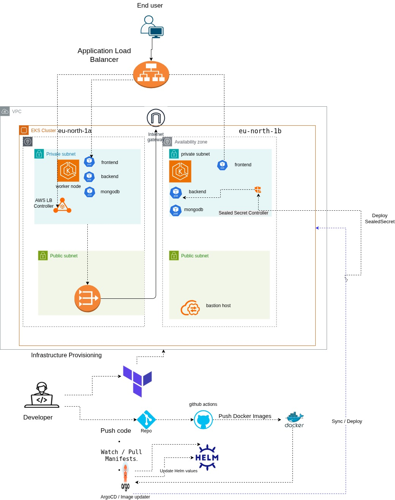

# CloudBite - Food Delivery Application Deployment on AWS EKS

## Project Overview

CloudBite is a full-stack food delivery application deployed on AWS using modern DevOps practices and cloud-native technologies.

This project demonstrates Infrastructure as Code (IaC), Kubernetes orchestration, GitOps deployment, secrets management, persistent storage provisioning, and cloud-native networking using Amazon EKS.

The application consists of:

* Frontend Application
* Backend API
* MongoDB Database
* AWS Application Load Balancer
* ArgoCD GitOps Platform

---

# Architecture



# Technologies Used

## Cloud Platform

* AWS

## Infrastructure as Code

* Terraform

## Containerization

* Docker
* Docker Hub

## Kubernetes

* Amazon EKS
* Deployments
* Services
* Ingress
* PersistentVolumeClaims
* StorageClasses

## GitOps

* ArgoCD

## Package Management

* Helm

## Secrets Management

* Bitnami Sealed Secrets

## Load Balancing

* AWS Load Balancer Controller
* AWS Application Load Balancer (ALB)

## Database

* MongoDB

## Application Stack

### Frontend

* React

### Backend

* Node.js
* Express.js

---

# Infrastructure Provisioning

Infrastructure was provisioned using Terraform.

## Resources Created

### Networking

* VPC
* Public Subnets
* Private Subnets
* Internet Gateway
* Route Tables

### Compute

* Amazon EKS Cluster
* Managed Node Group

### Security

* IAM Roles
* IAM Policies
* OIDC Provider
* Security Groups

### Storage

* EBS Volumes
* EBS CSI Driver

### Load Balancing

* AWS Load Balancer Controller

---

# Deployment Workflow

## Step 1

Provision AWS infrastructure using Terraform.

```bash
terraform init
terraform plan
terraform apply
```

## Step 2

Install ArgoCD.

```bash
kubectl create namespace argocd

kubectl apply -n argocd \
-f https://raw.githubusercontent.com/argoproj/argo-cd/stable/manifests/install.yaml
```

## Step 3

### Install Sealed Secrets Controller

```bash
helm repo add sealed-secrets https://bitnami-labs.github.io/sealed-secrets
helm repo update

helm install sealed-secrets-controller sealed-secrets/sealed-secrets \
  -n kube-system
```
```

## Step 4

Install AWS Load Balancer Controller.

```bash
helm install aws-load-balancer-controller ...
```

## Step 5

Deploy CloudBite Application using ArgoCD.

```bash
kubectl apply -f argocd.yaml
```

## Step 6

ArgoCD continuously synchronizes changes from GitHub to Kubernetes.

---

# GitOps Workflow

```text
Developer
    |
    v
Git Push
    |
    v
GitHub Repository
    |
    v
ArgoCD Detects Changes
    |
    v
Helm Chart Rendering
    |
    v
Kubernetes Cluster Update
```

Benefits:

* Declarative deployments
* Automated synchronization
* Self-healing infrastructure
* Version-controlled deployments

---

# Application Components

## Frontend

Responsibilities:

* User interface
* Product browsing
* Ordering experience

Deployment:

* Kubernetes Deployment
* Kubernetes Service

---

## Backend

Responsibilities:

* REST API
* Authentication
* Business Logic
* Database Operations

Deployment:

* Kubernetes Deployment
* Kubernetes Service

---

## MongoDB

Responsibilities:

* Persistent Data Storage

Deployment:

* Kubernetes Deployment
* Persistent Volume Claim
* Kubernetes Service

---

# Persistent Storage

Persistent storage is provided using Amazon EBS.

## Storage Components

* EBS CSI Driver
* StorageClass
* PersistentVolumeClaims

PVCs:

* backend-pvc
* mongodb-pvc

---

# Secrets Management

Sensitive information is stored using Sealed Secrets.

Protected Secrets:

* JWT_SECRET
* MONGO_URL
* STRIPE_SECRET_KEY
* MongoDB Credentials

Benefits:

* Safe storage in Git repositories
* Encrypted Kubernetes secrets
* GitOps-friendly secret management

---

# Ingress & Load Balancing

Traffic enters through:

AWS Application Load Balancer

Ingress routes:

```text
/      -> Frontend Service
/api   -> Backend Service
```

Configuration:

* Internet Facing ALB
* Target Type: IP
* Automatic Target Registration

---

# CI/CD Process

Current deployment pipeline:

```text
Developer
    |
    v
GitHub Push
    |
    v
ArgoCD Sync
    |
    v
Kubernetes Deployment
    |
    v
Application Update
```

---

# Challenges Faced & Solutions

## 1. PVCs Stuck in Pending State

### Problem

MongoDB and Backend Pods remained in Pending state.

### Root Cause

PersistentVolumeClaims were created without a valid StorageClass.

### Solution

Added:

```yaml
storageClassName: gp2
```

to PVC definitions.

---

## 2. EBS Volume Provisioning Failure

### Problem

Volumes were not being dynamically provisioned.

### Root Cause

Cluster relied on outdated storage provisioning configuration.

### Solution

Installed and configured Amazon EBS CSI Driver.

---

## 3. ArgoCD OutOfSync State

### Problem

Resources were not synchronized correctly.

### Root Cause

Manifest inconsistencies and namespace mismatches.

### Solution

Updated manifests and forced ArgoCD synchronization.

---

## 4. Ingress Deployment Failure

### Problem

Ingress creation failed.

### Root Cause

Ingress was configured with:

```yaml
ingressClassName: nginx
```

while only ALB Controller existed.

### Solution

Changed to:

```yaml
ingressClassName: alb
```

---

## 5. Sealed Secrets Namespace Issue

### Problem

Secrets were unavailable to application workloads.

### Root Cause

Sealed Secrets existed in a different namespace.

### Solution

Recreated secrets inside the application namespace.

---

## 6. MongoDB Connection Failure

### Problem

Backend continuously restarted.

### Root Cause

Incorrect MongoDB connection string.

### Solution

Generated new sealed secrets with valid MongoDB connection values.

---

## 7. IAM Resource Conflicts

### Problem

Terraform apply failed.

### Root Cause

IAM policies and OIDC providers already existed.

### Solution

Reused existing resources instead of creating duplicates.

---

# Validation

Verify deployments:

```bash
kubectl get pods -n cloudbite-dev
```

Verify services:

```bash
kubectl get svc -n cloudbite-dev
```

Verify ingress:

```bash
kubectl get ingress -n cloudbite-dev
```

Verify ArgoCD:

```bash
kubectl get applications -n argocd
```

---

# Future Enhancements

## Security

* Configure HTTPS using AWS ACM
* Enable WAF protection
* Implement External Secrets Operator

## Monitoring

* Prometheus
* Grafana
* AlertManager

## Logging

* ELK Stack
* Loki + Grafana

## Scaling

* Horizontal Pod Autoscaler (HPA)
* Cluster Autoscaler

## DNS

* Route53 Integration
* ExternalDNS

## CI/CD

* GitHub Actions
* Automated Image Builds
* Automated Security Scanning

## Database

* Automated MongoDB Backups
* Disaster Recovery Strategy

## Environments

* Development
* Staging
* Production

---

# Screenshots

Add screenshots for:

* AWS EKS Cluster
  
  

* Terraform Apply Success
  
  

* ArgoCD Dashboard
  
  
  
* Running Pods

  

* Load Balancer
  
  

* Application Home Page
  
  

* Kubernetes Resources
  
  


---

# Project Outcome

Successfully deployed a production-style cloud-native application on AWS using:

* Terraform
* Amazon EKS
* Docker
* Kubernetes
* Helm
* ArgoCD
* GitOps
* Sealed Secrets
* AWS Load Balancer Controller
* Amazon EBS CSI Driver
* MongoDB

This project demonstrates end-to-end DevOps practices, cloud infrastructure automation, Kubernetes operations, and GitOps-based continuous delivery.

---

# Author

**Sohila Mustafa**

DevOps Engineer
